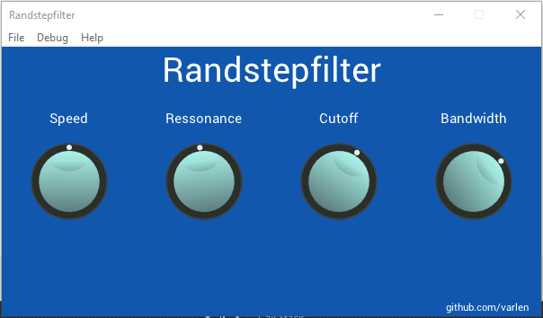

# Randstepfilter

---

This is a simple VST plugin built using [iPlug2](https://github.com/iPlug2/). It is currently under development. 

It is supposed to work as a Voltage Controlled Filter with a random sample and hold control input, where s&h rate can be adjusted, as well as the filter parameters. 

My goal is to make it sound kinda like [this](https://www.youtube.com/watch?v=sHZpOAgdY0s) in a guitar, while refreshing my C++ knowledge and learning how to make VST plugins.

